# SnakeHome

## Entry 1
- Author: Nader
- Created At: 2026-06-27

### Content

Well, first entry for SnakeHome.

OK, i love starting all my hardware projects by brainstorming and using figjam to make mind maps. (I'm a lier, this is just my second time.)

I made a new figjam and put its main topic on how to make a Smart Home system.

and set my searching goals for the day (which i didn't search them all in that day tbh).
And then started searching about them. 

i started with the device i will be using as the host or the controller for the system.

and found two things, (Raspis, and ESPs). The difference was that the Raspis can work as a full host for the whole system with its integrations and automations,and also can control. while the ESP just controls the relays and so on. (The Raspis do them efficiently while the ESP maybe can do them but with delays since they are with low specs).

So, i picked the Raspis to use them to host the whole system, since iam planning to control many things and use a screen.

After that i search for the systems (Firmwares, or OSs) i can be using on this Raspberry Pi. (And yeah i can use a regular Raspi zero 2 w, since iam planning to host the big things like AI on my home server.) And i found three good firmwares. 
- openHUB
- Home Assistant (The most popular)
- Domoticz

tbh i just picked Home Assistant since the others are made for just simple home assistanting, while Home Assistant can literally do anything. 

after that, i searched for the things that i can connect them (non-branded, i want to make my own). so i found that i can connect any sensors and relays and screens or mic and speakers (if i wanna make a voice assistant)  

this is my figjam till now.

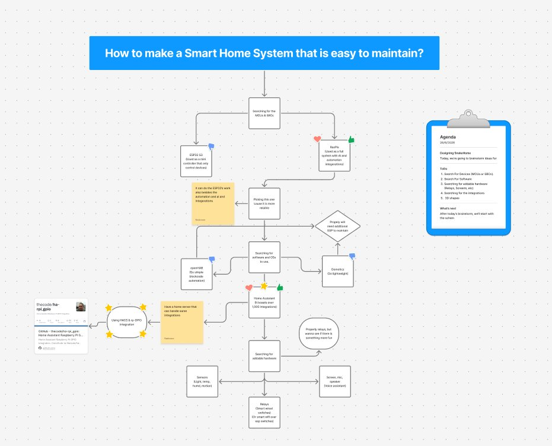

So, yeah, that's it for now iam gonna search more tomorrow.

### Recording Links (1.1 hours)

- https://lapse.hackclub.com/timelapse/IROoPYTvreb8

## Entry 2
- Author: Nader
- Created at: 2026/07/29

### Content

> ![Note]
> The Recording on Lapse missed to sync the lookout rec with a regular lapse session, So iam linking the rec here.

Uhh, i kept searching so i can fill this figjam brainstorming page.

I searched for a long time about if the Ras Pi zero 2w will be enough for hosting HAOS and also use HAOSkiosk to show the controls on a screen.

Well, i didn't find a lot, but regularly using a pi zero with any GUI thingy will be not good. 

So, decided to use a pi 4 to host HAOS and also us Kiosk mode at the same time.

And yeah, i was searching if i can use Kiosk mode with the HAOS already, since the HAOS is only TUI. 

Found many replys and articals that says to use the docker version so i can have a desktop environment accessing a regular browser.

but i won't be able to use the HAOS addons, and i want to make an voice assistant. 

Found that i can use other dockers hosting these addons instead. but i don't feel that will use resources efficently.

So, i kept searching until i found that HAOSkiosk extension. So, i will use it with using the original HAOS. 

Also i watched some vids from Networkchuck about making an voice assistant on Home assistant. So i got the addons he used and linked them into the figjam.

and yeah here you are the [figjam](https://www.figma.com/community/file/1654072093902823730).

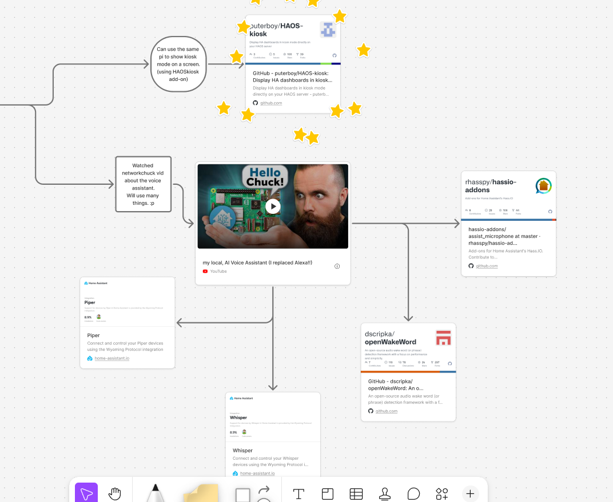

And yeah the last thing for this session that i searched for the speakers and the microphone i will be using. 

And i found that i can use my home bluetooth speakers setup with that, and using a regular AUX or usb microphone for the input commands and wake word.

and oh also i found a pretty cooooool HDMI capacitive touch screen, found the perfect size i want and with a perfect price, only 25 USD. 

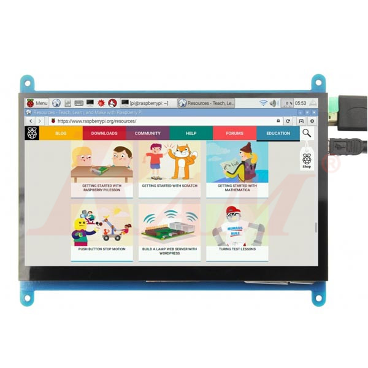

and that's it for this session.

### Recodring link (1.18 hours)

- https://lookout.hackclub.com/api/media/b3938cf8-cb90-4093-88ec-feb752db837c/video.mp4

## Entry 3
- Author: Nader
- Created at: 2026/07/30

### Content

Uhh, this was the longest session till now. 6 Whole hours wow. (Of course i paused some time)

Well, litearly iam so close to finish this all. i really made so much work on this session. maybe it is only 2 or 3 session away from finishing this project. (tbh iam making a real easy thing this time)

ok, i kept searching from the last time i paused. there were missing to research about the relays and switches and also the sensors i will be using.

Starting with the relays, well this one i found a real good deal for it.

A 16 channel big relays board, the only thing that it is fully wired. No wireless. 

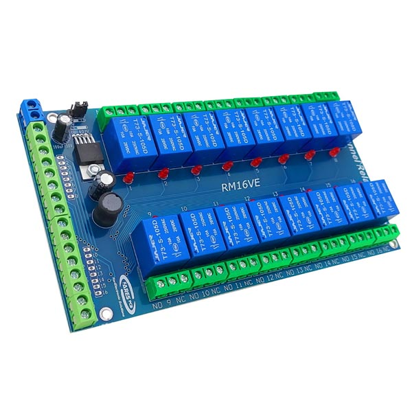

Well, i will talk about this more when i finish the PCB 'cause i rethinked about it. but i thought it is a good deal and cheap so i choosed it.

Ok after searching for this relay channels board. I searched also for some sensors to use with Home assistant.

Well, ok tbh i didn't find many interesting things but i picked the temp and humidety sensor and the motion sensor. 

- temp can be used around my whole house.
- and motion sensor can be used with light automation for examble.

So, after searching about those. Decided to make a 1 layer ras pi hat for them so they can be easy to connect.

Espcially the Relay channels. 

So after that, i can switch to the next phase of the project designing process which is the PCB designing. 

After these super cool brainstorming sessions. And gathering all the information that will be used with building this project.

Iam now ready to start with the real designing.

So i made a kicad project, and because of my previous projects. I found all the components i will add to the schematic so easliy. Found the ras pi symbol, the temp symbol that i made before.

and quickly made a symbol for the relay channels and the motion sensor connections.

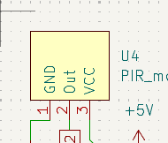

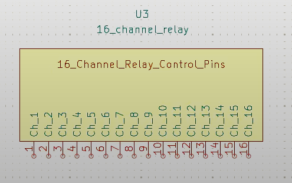

After that i connected all the temp sensors with the same I2C bus (I knew something after finishing the whole PCB that i can't do that but will come to this later), and also connected the motion sensors with GPIOS for each, since they are just true and false singals.

And yay i finished the Schem, So after that i assigned the footprints. The raspi took the 2*20 pinsocket footprint, since i want it as a hat.

And the sensors took pinHeaders for each. So i can connect jumper to them. 

And the relays was planned to take TerminalBlocks footprint, and i searched a lot for the terminal blocks 3D and Footprints until i catched a really importent thing.

Surprisingly i saw a 2 channel wireless relays that i can buy from them 4 and spread them around my house. since i only need at maximum 8 channels for my lights in my house not anymore. 

the difference in price wasn't that huge, 5 dollers more for being able to do it as wireless is not bad at all.

So, i changed the plan and took of the relays from the PCB and it will be only the sensors and the Raspi pinsocket. (Will add a I2C multiplexer because of the I2C bus problem, the temp sensors have the same address)

So after adding the footprints and importing to the PCB i simply added the pinsocket on the front side and the sensors pinheaders on the backside and traced them from only one layer to reduce the printing price and finally added an zone fill for all the GNDS.

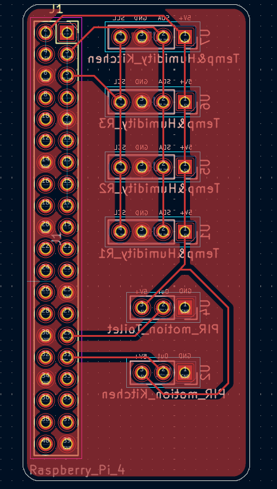
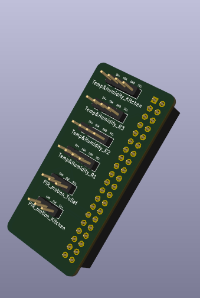

After that i exported the 3D PCB and will see now the 3D case.

This is the third phase of the designing process, the 3D Case design.

Well, i always use onshape for these designs. But after updating fusion 360 and the lags and bugs has been fixed i decided to try fusion as it will save my internet qouta. 

Well, there is no that much difference anyways. Well, i started by searching and downloading 3D models for the Raspi 4 and the screen. 

and after that i made two part studios, one for the top case and one for the bottom case. 

i used the Touch screen 3D as a dimensions for the case box that will has all the wires and the Raspi 4 inside. 

After taking the Screen dimensions, i made the box on it and added the Raspi 4 with the hat assembled on it, inside the box. 

But first i made the top case and used the project tool that can take the edges and faces from a context 3D on a sketch. i used it with the Screen and the top case. 

and after taking edges of the screen and the screw holes. i extruded the top case with 5 mm to cover the screen. 
And extruded a thin square to be as a mounting extruded part to perfectly align on the bottom case. 

i made that square using he offset tool.

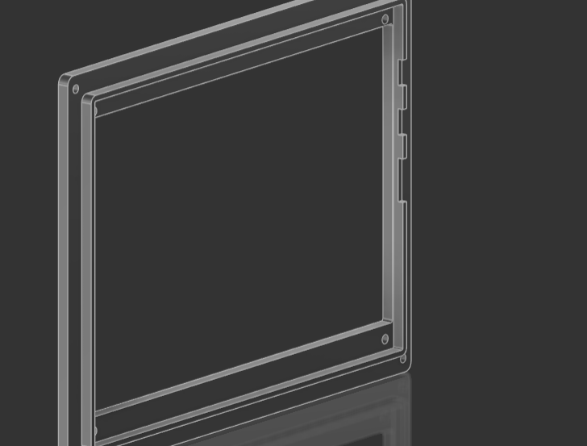

and after that i edited the bottom case in place so i can see where are the whole of the USBs and the LAN and the HDMIs and the Type C port and so on. 

So i made holes of everything and also made holes for the screws. 

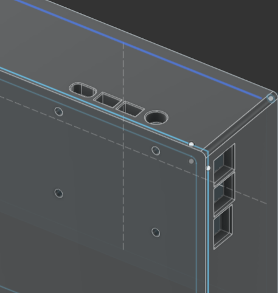

after that, i found a super cool great feature in fusion. Brooooo, i can eassliyyyy add screwwwwss and bolts and inserts without downloading any models and it auto detects the size and auto detects all the other same holes on the model and add the screw iam adding. honstly wow. i love that feature.

So i used it to add the screws and inserts for the Raspi 4 and also screws and bolts for the display.

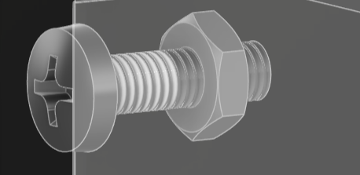

And for the top and bottom cases screws on each other. 

Well, at first when i tried to make two circules for the insert and the screw, i didn't think that i have much area for it. 

So, i reduced the rounding of the four corners so i can have much space. And then added the inserts and the screws and it is perfect now.

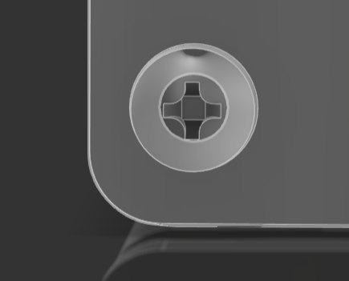.

After finishing all of these screws. i Added holes for all the sensors wires, as the sensors are the only things that will be wired directly to the Pi.

and added names on top of each hole.

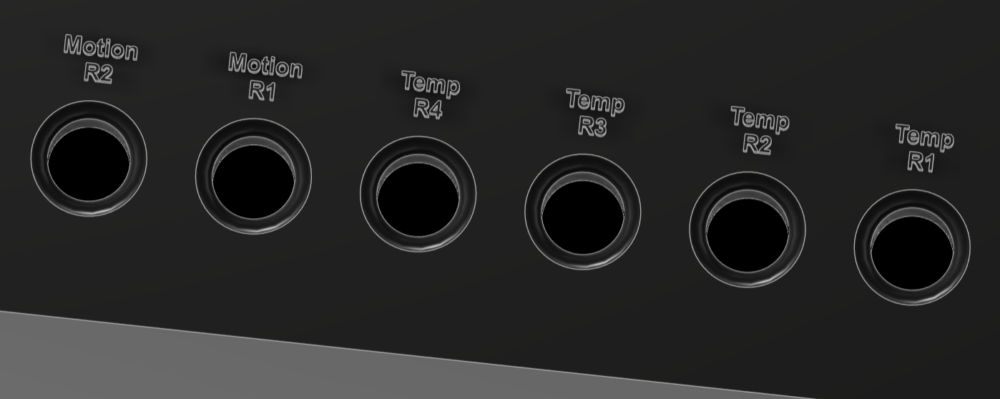

And that's it till now for the case. 

I need to polish it moreeeee and also give it a snake style. 

And then i can work on the yaml file for the relays and also the HAOS configuration guide (maybe i will make that as a markdown guide if i didn't find a code for it too. but i think i will do both as i will need python to use the raspi 4 GPIOs.)

### Recording links (6.3 hours):
- https://lapse.hackclub.com/timelapse/7yJxWss80vJH 