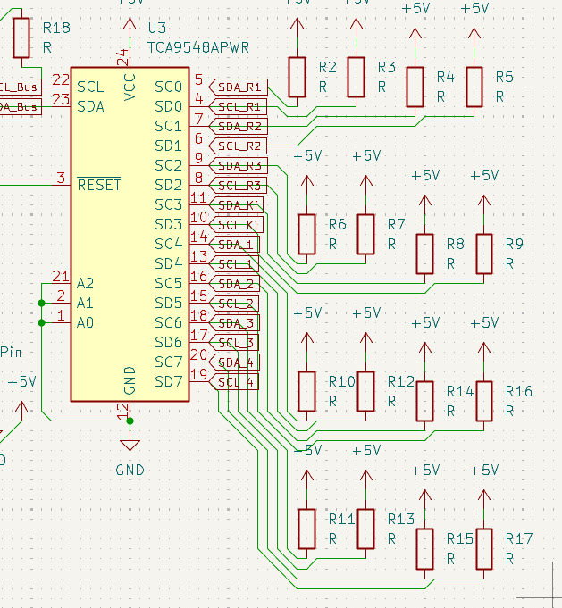
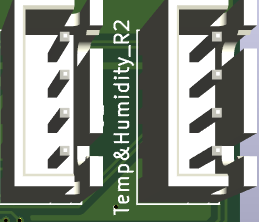
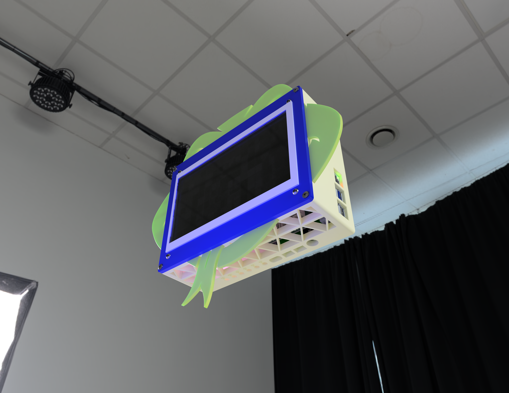
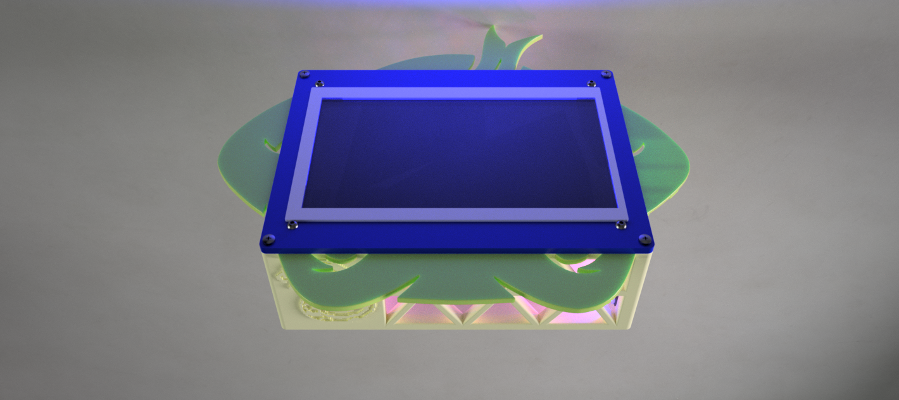
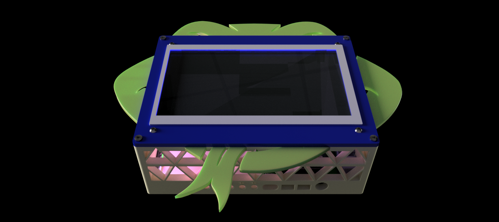

# SnakeHome

## Entry 1
- Author: Nader
- Created At: 2026-06-27

### Content

Well, first entry for SnakeHome.

OK, i love starting all my hardware projects by brainstorming and using figjam to make mind maps. (I'm a lier, this is just my second time.)

I made a new figjam and put its main topic on how to make a Smart Home system.

and set my searching goals for the day (which i didn't search them all in that day tbh).
And then started searching about them. 

i started with the device i will be using as the host or the controller for the system.

and found two things, (Raspis, and ESPs). The difference was that the Raspis can work as a full host for the whole system with its integrations and automations,and also can control. while the ESP just controls the relays and so on. (The Raspis do them efficiently while the ESP maybe can do them but with delays since they are with low specs).

So, i picked the Raspis to use them to host the whole system, since iam planning to control many things and use a screen.

After that i search for the systems (Firmwares, or OSs) i can be using on this Raspberry Pi. (And yeah i can use a regular Raspi zero 2 w, since iam planning to host the big things like AI on my home server.) And i found three good firmwares. 
- openHUB
- Home Assistant (The most popular)
- Domoticz

tbh i just picked Home Assistant since the others are made for just simple home assistanting, while Home Assistant can literally do anything. 

after that, i searched for the things that i can connect them (non-branded, i want to make my own). so i found that i can connect any sensors and relays and screens or mic and speakers (if i wanna make a voice assistant)  

this is my figjam till now.

So, yeah, that's it for now iam gonna search more tomorrow.

### Recording Links (1.1 hours)

- https://lapse.hackclub.com/timelapse/IROoPYTvreb8

## Entry 2
- Author: Nader
- Created at: 2026/07/29

### Content

> ![Note]
> The Recording on Lapse missed to sync the lookout rec with a regular lapse session, So iam linking the rec here.

Uhh, i kept searching so i can fill this figjam brainstorming page.

I searched for a long time about if the Ras Pi zero 2w will be enough for hosting HAOS and also use HAOSkiosk to show the controls on a screen.

Well, i didn't find a lot, but regularly using a pi zero with any GUI thingy will be not good. 

So, decided to use a pi 4 to host HAOS and also us Kiosk mode at the same time.

And yeah, i was searching if i can use Kiosk mode with the HAOS already, since the HAOS is only TUI. 

Found many replys and articals that says to use the docker version so i can have a desktop environment accessing a regular browser.

but i won't be able to use the HAOS addons, and i want to make an voice assistant. 

Found that i can use other dockers hosting these addons instead. but i don't feel that will use resources efficently.

So, i kept searching until i found that HAOSkiosk extension. So, i will use it with using the original HAOS. 

Also i watched some vids from Networkchuck about making an voice assistant on Home assistant. So i got the addons he used and linked them into the figjam.

and yeah here you are the [figjam](https://www.figma.com/community/file/1654072093902823730).

And yeah the last thing for this session that i searched for the speakers and the microphone i will be using. 

And i found that i can use my home bluetooth speakers setup with that, and using a regular AUX or usb microphone for the input commands and wake word.

and oh also i found a pretty cooooool HDMI capacitive touch screen, found the perfect size i want and with a perfect price, only 25 USD. 

and that's it for this session.

### Recodring link (1.18 hours)

- https://lookout.hackclub.com/api/media/b3938cf8-cb90-4093-88ec-feb752db837c/video.mp4

## Entry 3
- Author: Nader
- Created at: 2026/07/30

### Content

Uhh, this was the longest session till now. 6 Whole hours wow. (Of course i paused some time)

Well, litearly iam so close to finish this all. i really made so much work on this session. maybe it is only 2 or 3 session away from finishing this project. (tbh iam making a real easy thing this time)

ok, i kept searching from the last time i paused. there were missing to research about the relays and switches and also the sensors i will be using.

Starting with the relays, well this one i found a real good deal for it.

A 16 channel big relays board, the only thing that it is fully wired. No wireless. 

Well, i will talk about this more when i finish the PCB 'cause i rethinked about it. but i thought it is a good deal and cheap so i choosed it.

Ok after searching for this relay channels board. I searched also for some sensors to use with Home assistant.

Well, ok tbh i didn't find many interesting things but i picked the temp and humidety sensor and the motion sensor. 

- temp can be used around my whole house.
- and motion sensor can be used with light automation for examble.

So, after searching about those. Decided to make a 1 layer ras pi hat for them so they can be easy to connect.

Espcially the Relay channels. 

So after that, i can switch to the next phase of the project designing process which is the PCB designing. 

After these super cool brainstorming sessions. And gathering all the information that will be used with building this project.

Iam now ready to start with the real designing.

So i made a kicad project, and because of my previous projects. I found all the components i will add to the schematic so easliy. Found the ras pi symbol, the temp symbol that i made before.

and quickly made a symbol for the relay channels and the motion sensor connections.

After that i connected all the temp sensors with the same I2C bus (I knew something after finishing the whole PCB that i can't do that but will come to this later), and also connected the motion sensors with GPIOS for each, since they are just true and false singals.

And yay i finished the Schem, So after that i assigned the footprints. The raspi took the 2*20 pinsocket footprint, since i want it as a hat.

And the sensors took pinHeaders for each. So i can connect jumper to them. 

And the relays was planned to take TerminalBlocks footprint, and i searched a lot for the terminal blocks 3D and Footprints until i catched a really importent thing.

Surprisingly i saw a 2 channel wireless relays that i can buy from them 4 and spread them around my house. since i only need at maximum 8 channels for my lights in my house not anymore. 

the difference in price wasn't that huge, 5 dollers more for being able to do it as wireless is not bad at all.

So, i changed the plan and took of the relays from the PCB and it will be only the sensors and the Raspi pinsocket. (Will add a I2C multiplexer because of the I2C bus problem, the temp sensors have the same address)

So after adding the footprints and importing to the PCB i simply added the pinsocket on the front side and the sensors pinheaders on the backside and traced them from only one layer to reduce the printing price and finally added an zone fill for all the GNDS.

After that i exported the 3D PCB and will see now the 3D case.

This is the third phase of the designing process, the 3D Case design.

Well, i always use onshape for these designs. But after updating fusion 360 and the lags and bugs has been fixed i decided to try fusion as it will save my internet qouta. 

Well, there is no that much difference anyways. Well, i started by searching and downloading 3D models for the Raspi 4 and the screen. 

and after that i made two part studios, one for the top case and one for the bottom case. 

i used the Touch screen 3D as a dimensions for the case box that will has all the wires and the Raspi 4 inside. 

After taking the Screen dimensions, i made the box on it and added the Raspi 4 with the hat assembled on it, inside the box. 

But first i made the top case and used the project tool that can take the edges and faces from a context 3D on a sketch. i used it with the Screen and the top case. 

and after taking edges of the screen and the screw holes. i extruded the top case with 5 mm to cover the screen. 
And extruded a thin square to be as a mounting extruded part to perfectly align on the bottom case. 

i made that square using he offset tool.

and after that i edited the bottom case in place so i can see where are the whole of the USBs and the LAN and the HDMIs and the Type C port and so on. 

So i made holes of everything and also made holes for the screws. 

after that, i found a super cool great feature in fusion. Brooooo, i can eassliyyyy add screwwwwss and bolts and inserts without downloading any models and it auto detects the size and auto detects all the other same holes on the model and add the screw iam adding. honstly wow. i love that feature.

So i used it to add the screws and inserts for the Raspi 4 and also screws and bolts for the display.

And for the top and bottom cases screws on each other. 

Well, at first when i tried to make two circules for the insert and the screw, i didn't think that i have much area for it. 

So, i reduced the rounding of the four corners so i can have much space. And then added the inserts and the screws and it is perfect now.

.

After finishing all of these screws. i Added holes for all the sensors wires, as the sensors are the only things that will be wired directly to the Pi.

and added names on top of each hole.

And that's it till now for the case. 

I need to polish it moreeeee and also give it a snake style. 

And then i can work on the yaml file for the relays and also the HAOS configuration guide (maybe i will make that as a markdown guide if i didn't find a code for it too. but i think i will do both as i will need python to use the raspi 4 GPIOs.)

### Recording links (6.3 hours):
- https://lapse.hackclub.com/timelapse/7yJxWss80vJH 

## Entry 4
- Author: Nader
- Date: 1/7/2026

### Content

Well, yeah as i said the I2C bus can't drive more then one same address sensor. So, yeah i needed to add am I2C Multiplexer. 

Soooo, i did the most thing i hate, which is editing the PCB again.

Starting with the schematic. I searched a lil about an I2C multiplexer module that i can use with these sensors. 

Well, i found many modules but i prefered using an SMD module to integret with the PI Hat directly.

So, i added the symbol, and search a lil on how to connect it, and found that i need to use two pullup resistors on each I2C bus
. Even the I2C input bus. So, i added all the pullup resistors and connected them to each I2C pins in the module like that. 

After connecting the pullup resistors, i connected lables for each I2C bus, and connected 4 Pins for the remaining I2C buses that iam not using while connected the 4 Temp sensors to the first 4 Buses.

After that, i Assigned all the sensors and the I2C buses (Even the assigned pin headers) a new Footprint for a JST connector instead of a PinHeader that can be disconnected easly. 

After assigning all the Connectors and the I2C multiplexer.

I found that the Pull up resistors will take a super masive place, so i decided to search about smaller SMD resistors i can use. 

And i found the 0402 size the best for this application. So, i assigned them, and then i switched to the PCB editor.

So, after that, i need to find a good pattern that i can follow so i can try to trace them all cleanly and without a mess.

So, i i found that i can trace all the resisors besides the I2C multiplexer, each next to its pin. like this:

and after connecting the resistors, i can connect all the I2C buses from inside the I2C multiplexer footprint, to the top and the bottom of the footprint. like that

And after connecting all the Buses, I can just use a Zone fill to connect all the GNDs, and then just connected the two Motion sensors to the their pins in the Pi's. 

After connecting this also, i finished the PCB and Exported the 3D PCB.

And that's it for this session. Next i will need to polish the 3D case and add the new Pi Hat.

### Recording links (3.3 hours):
- https://lapse.hackclub.com/timelapse/xZ0LxxVgFc7T

## Entry 5
- Author: Nader
- Date: 4/7/2026 

### Content

Well, yay i won't touch the PCB again. (I wish)

Ok, at this session i will need to work on the 3D case and assembly and i will need to polish it more, 'cause it seems a lil brick like now. 

Ok, i think this is the first Polishing phase for this case.

Well, because the project name is "SnakeHome", and the description literaly is saying a Snake-Styled home assistant device. 

So it is super normal to add snake textures and faces. (I hope it is really like a snake not a frog now)

So, my first thoughts was about to get a snake image and convert it to a DXF file and add it to the case's wall. Well, that is not a bad idea, but i can't make all the walls just like that. 

So i just added one image. 

TBH this one was kinda hard to add, as fusion was kinda buggy when i try to select all the sketch entities of the snake and move them. 

I kept trying till i finished it.

After that, i got an other idea, which is to make triangles on the case and extrude cut them and curve the sharp triangle sides.

So i needed to draw first a reference rectangle so i can make them aligned in the center and to each other.

So i ended up with something like this

And yeah it looks cool tbh for me.

Well, after these trianlges.

I got an other idea to make the case it self looks like a snake Head. So, I searched about a good drawen snake head and found a prety good one. So i also converted it into a DXF file and imported it. 

And here is the nightmare. Fusion was soooooooo super buggy when i try move the sketch entites one millimeter. 

So i search for another way to add the shape to the case.

Well, i found a kinda good one. It is to add the DXF file to an individual Part Studio which i can extrude directly the faces into it. And deal the snake head as bodies not thousends of sketch entities, So, ok that was a great option for me tbh.

So i took the bodies of the snake head and added it to the assembly and thought on where i will add it around the case.

At first i thought to place it on the very back side, but i prefered adding it near to the case's Top cover.

And i tried to add it and delete the additional parts preventing any access to the inside of the Case.

Well i ended up with something like this, after changing the colors.

So yeah it looks so awesome (Even while it is kinda looks like a frog not a snake)

And yeah that's it for this polishing try. 

Next time i will need to add another triangles to the other side near the Pi type C. 

### Recording links (3 hours):
- https://lapse.hackclub.com/timelapse/rP8YhDRfef3z

## Entry 6: 
- Author: Nader
- Date: 5/7/2026 

### Content

Well, in this session i saw a sooo stupid error that was not solvable.

ok, well when i started working this time. 

i faced as stupid bug, when i try to move the 3D bottom case, the whole fusion360 crashes. Without any explnation. 

it literaly keeps crashing each time i try to do any thing. After sooo many trials, i couldn't find the problem. 

So i just deleted the whole asssembly and redid it all.

This time i kept naming everything i make in the timeline, but yeah this time i made everything quickly them before as i was knowing what iam doing. 

And yeah this all was because of that some sync in fusion decided to rotate the case without the other assembled things. 
So all the holes i made and so on were not aligned with the components. 

So that's why i was trying to rotate the case itself. 

well, it is now good and aligned. So i started with the triangles i said i will make last time. 

So i made them with the same way i made the trianlges in the other side. 

And just finished them and tbh i was soo exhusted so i endedd this for today. 
The troubleshooting took all my breath.

### Recording links (2.5 hours):
- https://lapse.hackclub.com/timelapse/ZdadXVKqlE6r

## Entry 7: 
- Author: Nader
- Date: 6/7/2026

### Content

Well, iam so close to finish this all. 

For this session i made a lot of things, So i will need to brick this out in a good way

Umm, i Started by thinking how i will hang the project on the wall. 

So the easiest thing was to just make two holes for the screws, holes with a special shape that lets you to mount and unmount the device without unscrew nails. 

It is something like this. 

Well i didn't find a real DXF file for this. SOOOO i just designed it myself.

I made a hole with M3 screws dimensions So i can mount it using M3 screws, i made it So like the hole i saw.

After that tbh, i felt that the project is missing something. it feels that the project needs some glowing NEOs.

Sooooooo, yeah i will use NEO sticks and will make for them a connector on the PCB and screw holes.

Starting the the PCB connector. (I know i said i won't this again but trust me this is legit)

Well, i focused on the PCB itself first to find the GPIO iam gonna use that is near to an empty place. 

So i found the pin, and added the NEO stick symbol in the schematic, and then connected it to the pin i choosed.

Leting me to find a SUPER PERFECT LOCATION FOR ITTT. it is like this place was made for it. 

IT is close to the pin and to the 5V trace and of course the fill zone GND.

So i added the footprint and easly traced it.

After editing the PCB, well, tbh there is no need to update it in the assembly anyways as it won't change anything like the dimensions or anything. I need to save my internet limited qouta :c 

So, i just added the neostick 3D model. 

Placed them in good places inside the case, and then i started to "project" the screw holes on the stick on the internal wall of the case and started extrude cut them. 

but when i went to add the inserts, i didn't find an M2 inserts (Didn't also catch that i can make my own size)

So i just downloaded the model from the internet. 

But i then relaized that i can make my own size when i went to add the screws, since i made my own M2 screw for them. 

and that's it for them i repeated this for all the 3D sticks. 

After adding these Neo sticks, i felt that all the snake face pieces needs to be rainforced in a more practical way. 

So i decided to add small pieces to push inside the case and glue them. 

well, after that, i fully finished the 3D assembly. and iam ready to start with the firmware. 

Well, this phase is a special phase. as i will need a lot of research and configurations.

So, iam gonna explain what iam did based on this research. 

well, first for all the wireless relays. iam gonna need a yaml file for ESPhome on these ESP12e chips. So i wrote the yaml to control relay pins as a regular on/off switch using the GPIOs i found on the user manual of the relays. 

And i found a GUI config writter that can help me with that. So, i just used it to know how to write configs and then i just copied pasted the swtich code and also added my creds and used an online builder to build the code 'cause i don't want to download many package just to build this small yaml.

The online builder was this [website](https://esphome-online-compiler.pages.dev/) that is using github actions to build the yaml. 

after using it and building the binaries i addded them to the repo

After that i needed to add the sensors, so first i found that i need to enable the I2C buses. So i found this [guide](https://www.abelectronics.co.uk/kb/article/1116/using-i2c-devices-with-home-assistant-on-the-raspberry-pi) to enable them on HAOS. and after that i can use an ESPhome integration to use the GPIOs from the pi on HAOS. or the gpio-haos extension but dk if it will has I2C. well, after this i wrote the yaml [configration](Firmware/configuration.yaml), that has the I2C multiplexer drivers and bus iam using and the sensors iam gonna use. 

and for the motion sensors i just used binary sensors for them.

and that's it for the configurations and yamls of this firmware.

After that i started working on tiding up the repo and making the BOM. 

And yeah i remembered that i didn't add a small usb microphone for the Voice assistant configuration iam gonna make (and linked the toturial on the readme)

So, i added the 3D model to the assembly and added it to the BOM too.

And that's it for this session, next iam gonna render i guess.

### Recording links (5.13 hours): 
- https://lapse.hackclub.com/timelapse/g5u17ZrcEpg7
- https://lapse.hackclub.com/timelapse/cG0KXqlFQet3

## Entry 8 (Last one i guess):
- Author: Nader
- Date: 7/7/2026

### Content

Well, this one would be so cool. 

Umm i started rendering the 3D case and tried to get great photos from it.

Soooo, i learned two things iam gonna say here.

the first one that i can add an environment from the internet and the second one that THErE IS leDssss

Well, the second one got me.

So, i started adding appearances for the parts, and for the NEOs and the screen, i added LED and adjusted the brightness and the colors. and made them look soo cool.

And also added a new environment that has a better lighting but, i think i prefer the dark background.

Well, i made these all cool renders.

Well, tbh this is the best renders i made till now. 

Annnndd i think i finished this all yayyyy.

### Recording links (1.18 hours):
- https://lapse.hackclub.com/timelapse/9D-8rwojk8Bn

## Thank you, reviewerrrr. ❤️