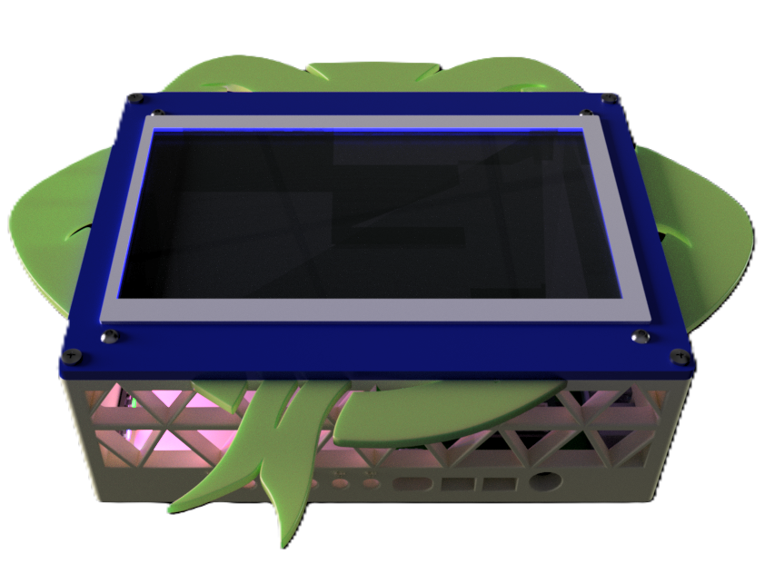
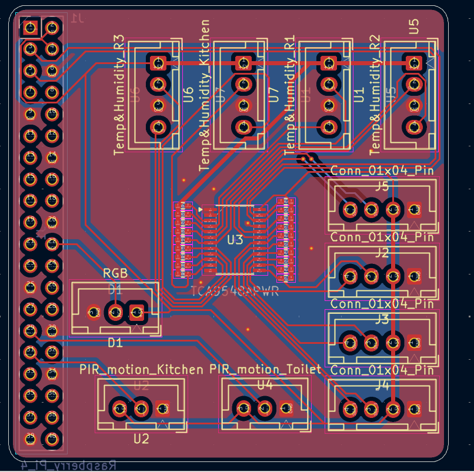
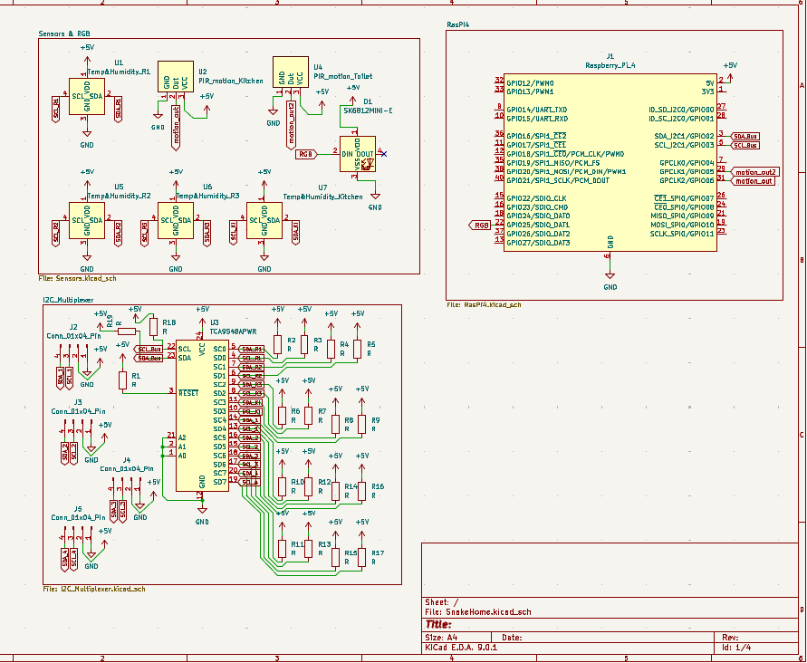
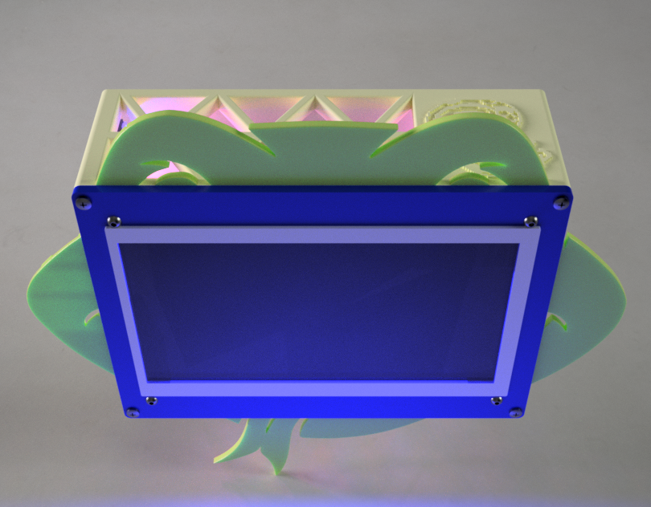
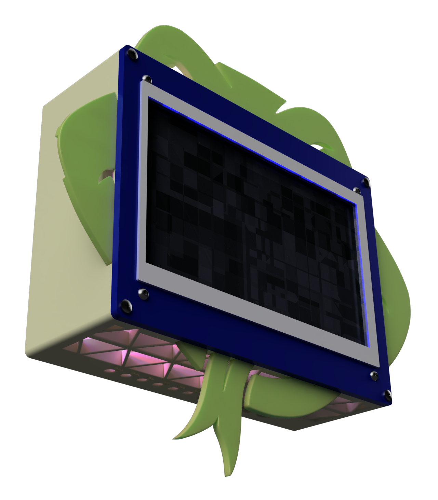

# SnakeHome

------------

  

------------

## Description:
SnakeHome is a local-hosted powerful Snake-Styled automation system, based on HAOS and using wireless relays and some sensors. Hosted on a Raspi 4 and directly driving I2C sensors and Digital sensors, using the Raspi's GPIO.

## Why I'm making this?
I like that I can automate and smartly control my whole house, and also using my voice to control it.
So, decided to make this project as i can host, control, automate, and integerate many things.

## Highlight:
* Snake-Styled Case
* Using I2C bus on the same Pi 4
* Has additional I2C buses using an I2C multiplexer
* Custom Pi Hat for the I2C buses, RGB strip, and Motion sensors.

## Some Photos:

### PCB:

### Schematic:

### 3D Case & Assembly:

> [!NOTE]
> Here you are the [Fusion Assembly Link](https://a360.co/44hYKPn)

## Bill of Materials:

| Item Name                                                                | Purchase Link                                                                                                                                                                                                      | Quantity | Price per Unit |                        Total |
| ------------------------------------------------------------------------ | ------------------------------------------------------------------------------------------------------------------------------------------------------------------------------------------------------------------ | -------: | -------------: | ---------------------------: |
| LCD HDMI 7 inch 800x480 Capacitive Touch Screen                          | [RAM-E Shop](https://www.ram-e-shop.com/shop/lcd-hdmi-7-lcd-hdmi-7-inch-800x480-capacitive-touch-screen-7048?srsltid=AfmBOorUe2tKtcn4JbvP1ZTpSPSQzv_4OBrRmaJJUFSKj4mR9VUcvmev)                                     |        1 |         $61.41 |                       $61.41 |
| Raspberry Pi 4                                                           | [Cytron](https://www.cytron.io/p-raspberry-pi-4-model-b-4gb?currency=USD&src=raspberrypi&__cf_chl_f_tk=1gVJC0yFA_oNHxKh2gmH2fEgdigKqShx7tK3YobdYoE-1783374661-1.0.1.1-hMaFJiEW5raPlFIFSo6CefCfJgAvDq53L9vreoigOKs) |        1 |           $100 |                         $100 |
| 4-Channel Wireless Relay Module ESP-12F (RM4W)                           | [Fares PCB](https://fares-pcb.com/product/4-channel-wireless-relay-module-esp-12f-rm4w/)                                                                                                                           |        5 |          $6.14 |                       $30.71 |
| AM-2320 Temperature & Humidity                                           | [RAM-E Shop](https://www.ram-e-shop.com/shop/sen-am2320-am-2320-temperature-humidity-calibrated-sensor-asair-r-original-brand-7776)                                                                                |        4 |          $3.58 |                       $14.32 |
| PIR Motion Sensor Module HC-SR501                                        | [RAM-E Shop](https://www.ram-e-shop.com/shop/kit-pir-module-pir-motion-sensor-module-hc-sr501-6673?srsltid=AfmBOooSD9HVb-FVRD6JP8KHQoaQlhenYvKXd5C95F_AjBWc5ugerphb)                                               |        2 |          $1.02 |                        $2.04 |
| TCA9548APWR I2C 8 channels bus multiplexer TSSOP24                       | [UGE-One](https://uge-one.com/product/tca9548apwr-i2c-8-channels-bus-multiplexer-tssop24/?srsltid=AfmBOooYz3AQkDL3NkKblc4A5gbOHgHDWNGNuuuX1uyoCiN8VXJXbU7l)                                                        |        1 |          $1.74 |                        $1.74 |
| Chip Resistor SMD 10Ω ±1% 62.5mW ±100ppm/℃ 0402                          | [Maker's Electronics](https://makerselectronics.com/product/chip-resistor-smd-10%cf%89-%c2%b11-62-5mw-%c2%b1100ppm-%e2%84%83-0402/)                                                                                |       11 |         $0.002 |                       $0.022 |
| B4B-XH-A JST XH Data Terminal Male 4 Pin Connector Header 2.5mm          | [Maker's Electronics](https://makerselectronics.com/product/b4b-xh-a-jst-xh-4-pin-header-2-5mm/)                                                                                                                   |        5 |         $0.012 |                        $0.06 |
| B3B-XH-A JST XH Data Terminal Male 3 Pin Connector Header 2.5mm          | [Maker's Electronics](https://makerselectronics.com/product/b3b-xh-a-jst-xh-3-pin-header-2-5mm/)                                                                                                                   |        2 |          $0.01 |                        $0.02 |
| Data Cable JST 3 Pin 2.54mm 26AWG 25cm One Side Terminal                 | [Maker's Electronics](https://makerselectronics.com/product/data-cable-3-pin-25cm-one-side/)                                                                                                                       |        2 |          $0.17 |                        $0.34 |
| PHR-4 JST PH Connector Housing Female 4 Pin 2mm with 20cm Terminal Cable | [Maker's Electronics](https://makerselectronics.com/product/phr-4-jst-ph-housing-4-2mm-20cm-cable/)                                                                                                                |        5 |          $0.10 |                        $0.50 |
| PCB (JLCPCB)                                                             | [JLCPCB Cart](https://cart.jlcpcb.com/)                                                                                                                                                                            |        5 |          $0.40 |                        $2.00 |
| E-POST (JLCPCB)                                                          | [JLCPCB Cart](https://cart.jlcpcb.com/)                                                                                                                                                                            |        1 |         $13.60 |                       $13.60 |
| 3D Prints                                                                | Local Vendor (Printfy-eg)                                                                                                                                                                                          |        1 |         $33.80 |                       $33.80 |
| NeoPixel Stick 8-bit WS2812 5050 RGB LED Driver Development Board        | [RAM-E Shop](https://www.ram-e-shop.com/shop/kit-ws2812-8-5050-strip-neopixel-stick-8-bit-ws2812-5050-rgb-led-driver-development-board-8257?srsltid=AfmBOoq2-D_xbTO2GzUTi27TZwHegidSzl2b0Z84DDxABTQgCfJVlCOd)      |        3 |          $1.00 |                        $3.00 |
| M3 & M2 Screws                                                           | [UGE-One Search](https://uge-one.com/?product_cat=&s=M3+screw&post_type=product)                                                                                                                                   |       18 |          $0.05 |                        $1.00 |
| M3 & M2 Inserts                                                          | [UGE-One Search](https://uge-one.com/?product_cat=&s=M3+screw&post_type=product)                                                                                                                                   |       18 |          $0.05 |                        $1.00 |
| USB Small Microphone | [Aliexpress](https://ar.aliexpress.com/item/1005005364449092.html?spm=a2g0o.productlist.main.3.5dff5b1cPDhfSt&algo_pvid=a4202c5b-f152-4748-b57b-737da53ad29c&algo_exp_id=a4202c5b-f152-4748-b57b-737da53ad29c-2&pdp_ext_f=%7B%22order%22%3A%22810%22%2C%22spu_best_type%22%3A%22price%22%2C%22eval%22%3A%221%22%2C%22fromPage%22%3A%22search%22%7D&pdp_npi=6%40dis%21EGP%21288.94%2153.27%21%21%215.37%210.99%21%402101590d17835041732383886e3d82%2112000032749797222%21sea%21EG%210%21ABX%211%210%21n_tag%3A-29910%3Bd%3A2e304f5e%3Bm03_new_user%3A-29895%3BpisId%3A5000000207410332&curPageLogUid=CMNS0Bh3jwOQ&utparam-url=scene%3Asearch%7Cquery_from%3A%7Cx_object_id%3A1005005364449092%7C_p_origin_prod%3A) | 1 | $1.00 | $1.00 |
| **TOTAL**                                                                | ~~                                                                                                                                                                                                                 |       ~~ |             ~~ | **$266.56 (THE PI IS HELL)** |

## How to Build:
1. Print the needed 3D parts and Pi hat.
2. Heat the inserts and put each one in its place.
3. Assemble the Pi4 and the Hat(After soldering it).
4. Place them inside the Case and use M3 screws to rainforce them.
6. Solder the 3 RGB Stick chain. 
5. Place the RGB Sticks and use M2 screws to rainforce them.
7. Connect the RGB sticks connector.
8. Connect the sensors connectors and take out each sensor wires from its hole.
9. Assemble the 3D Snake face parts and use Glue to rainforce them.
10. Assemble the Touch Screen using M3 screws in the Top Case.
11. Connect the Pis HDMI and USB to the screen. (The Screen will take its power from the USB as well as the Touch data.)
12. Place the Bottom Case on the wall and mark the Screw holes.
13. Make the holes in the wall and Place the 3D case on them.
14. Close the Top Case using M3 Screws.
15. Connect the Pi to Power and Lan cables.
16. Power on the Pi and use the [RasPi Imager](https://www.raspberrypi.com/software/) to Download and install the core Home assistant OS on your memory card.
17. Boot the Pi, and setup HAOS.
18. Enable the I2C bus using this [Method](https://www.abelectronics.co.uk/kb/article/1116/using-i2c-devices-with-home-assistant-on-the-raspberry-pi).
19. Use the [Configratino.yaml](Firmware/configuration.yaml) file to use the Sensors on the I2C bus, with the ESPHome integration in HAOS.
20. For the WiFi Relays, Flash the [Firmware Binary](Production/4ch_relays_BINs).
21. Connect it with HAOS as a ESPHome device.
22. Follow this [Tutorial](https://www.youtube.com/watch?v=XvbVePuP7NY) to integrate Voice assistant commands. (You can ignore the AI thingy)
23. Enjoy making automations and easy control over your house.

-------
# Made With ❤️, By Nadooor